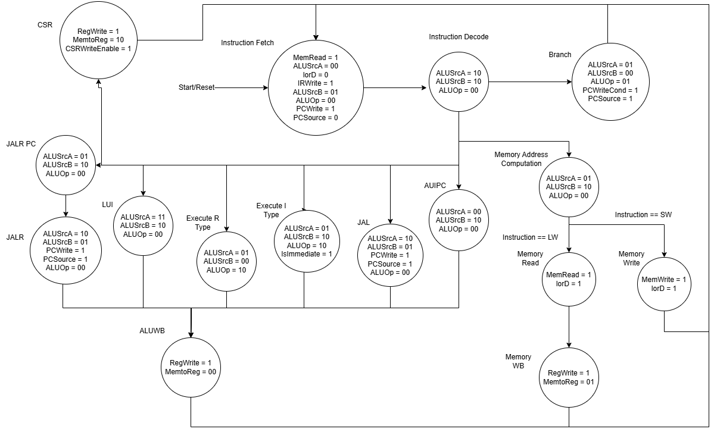
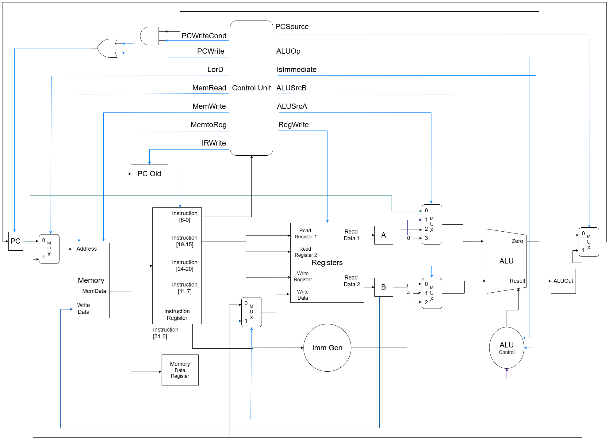

# Control Unit

A unidade de controle é uma peça central em processadores multiciclo, uma vez que ela é responsável por controlar cada módulo e decidir quando cada operação será feita. Essa unidade nada mais é uma máquina de estados que habilita seus sinais de saída em momentos específicos para gararantir sincronização entre os módulos.

## Como funciona a unidade de controle?

Cada instrução pode ser executada seguindo um conjunto de passos (ou estados) em ordem, um a cada ciclo. Esses passos foram baseados no já citado livro Digital Design and Computer Architecture RISC-V Edition por Harris e Harris.

É importante notar que instruções de tipos diferentes possuem conjuntos de passos diferentes. Cada estado aciona certos sinais dentro do processador e controla módulos diferentes. Esse controle é feito por meio de multiplexadores para guiar os dados e de sinais de *write enable* para habilitar ou não a escrita nos registradores.

Para instruções do tipo load:
1. Fetch: acessa a memória no endereço dado pelo PC e guarda a instrução no registrador correspondente;
2. Decode: extrai as partes da instrução e alimenta as entradas do banco de registradores, do gerador de imediato e de outros módulos;
3. MemAdr: usa a ALU para calcular o endereço de acesso à memória
4. MemRead: usa o endereço calculado anteriormente para acessar a memória e guarda a palavra lida num registrador.
5. MemWB: escreve o valor presente no registrador anterior no banco de registradores.

Instruções do tipo store:
1. Fetch: idem ao procedimento para loads;
2. Decode: idem ao procedimento para loads;
3. MemAdr: idem ao procedimento para loads;
4. MemWrite: escreve o dado presente no registrador selecionado no endereço correspondente na memória.

Instruções do tipo R:
1. Fetch: idem ao procedimento para loads;
2. Decode: idem ao procedimento para loads;
3. ExecuteR: seleciona as entradas corretas para a ALU e executa a operação desejada;
4. ALUWB: guarda o resultado da ALU obtido no estado anterior no banco de registradores.

Instrções de Branch:
1. Fetch: idem ao procedimento para loads;
2. Decode: idem ao procedimento para loads;
3. Branch: compara os valores dos registradores ao mesmo tempo em que calcula o endereço de salto. Se a condição for satisfeita, o salto é realizado.

Esses são alguns exemplos de estados da máquina de estados para a execução das instruções. O diagrama de estados final é um conjunto de caminhos em que cada caminho corresponde a um tipo de instrução. A decisão de qual caminho deve ser percorrido é feita a partir do opcode, que identifica o tipo de instrução.

Construir o caminho correto para a execução de cada instrução depende de um conhecimento detalhado do diagrama do circuito do processador e também de sua máquina de estados. As imagens a seguir mostram os diagramas do processador proposto.

Uma dica para compreender cada parte da máquina de estados é observar o fluxo de cada tipo de instrução: acompanhe a máquina de estados da unidade de controle enquanto vê as partes do caminho de dados que são acionadas.

## Atividade

Nesta atividade você deve criar uma máquina de estados que realize a função de unidade de controle do processador. Ela deve receber a instrução como entrada e gerar um conjunto de saídas na ordem correta, de acordo com o diagrama mostrado. Use o diagrama do circuito como referência para entender melhor o que cada sinal de controle está fazendo.

## Execução da Atividade

Utilize os templates fornecidos e execute os testes com o script `./run-all.sh`. O resultado será exibido como `OK` em caso de sucesso ou `ERRO` se houver alguma falha.

Se necessário, crie casos de teste adicionais para validar sua implementação.

---

## Entrega

Realize o *commit* no repositório do **GitHub Classroom**. O sistema de correção automática irá executar os testes e atribuir uma nota com base nos resultados.

> **Dica:**
> Não modifique os arquivos de correção. Para entender melhor o funcionamento dos testes, consulte o script `run.sh` disponível no repositório.